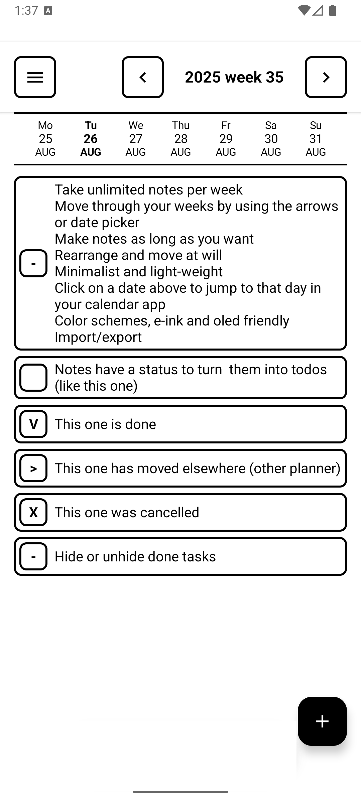

# WeeklyNotes

A simple Android application for managing weekly notes and tasks, optimized for e-ink displays like the one on the Mudita Kompakt. 

Explanatory screenshot:


This app was made for two reasons
- **Complete lack of weekly notes/planner apps**: I'll dive into this below.
- **To try 'vibe-coding'**: The app is built entirely by a toaster according to my functional requirements and then endless debugging

## Weekly notes concept

I have a paper notebook that I used to carry everywhere: the Hobonichi Techo Weeks. It's the only paper planner I know of that offers a full blank note-taking page per week, unencumbered by days or times. Each week features two pages: the left page displays the days (without hours) in a vertical layout, used for writing down only the big events of the week or things you don't track in a digital planner (project plans, workout schedules, meal planning, etc.). The right page is completely blank - a 'catch-all' page where you can jot down quick notes and tasks, much like a bullet journal. Because you have a page per week, you can also note things for past or future weeks. The back of the notebook contains additional blank, undated pages for overflow.

Most paper planners force you to plan day-by-day (even hour-by-hour) without offering a proper note area. Other planners provide a note area per day, catering to journaling enthusiasts (like the regular Hobonichi Techo). But I don't write that much, and I prefer staying in the flow of the week while seeing everything at a glance. Before discovering the Hobonichi weekly format, I tried Michael Hyatt's Full Focus Planner but mostly used just the week page for planning. It all depends on your lifestyle. For many people, weekly planning makes perfect sense, and tasks don't need to be strictly bound to specific days. The Hobonichi Techo Weeks is popular for exactly this reason.

The Hobonichi Techo boasts extraordinary build quality. It survives in my pockets for an entire year (it's wallet-sized) and stays intact. However, I do have to carry it along with a pen. Why is it part of my daily carry? Because it's absolutely the fastest way to quickly jot something down when inspiration strikes. I don't need to unlock my phone, find the right note app, locate an appropriate note, etc.

Hence, no app could replicate both the simplicity and versatility of the Hobonichi. With apps, you encounter a similar issue as with paper planners: you either get simple note-taking apps with no date or timing concept (except reminders), or basic planner apps with limited note-taking capability. Then there are the hybrid, bloated solutions like Notion, which are essentially feature-heavy nightmares. Some simple 'weekly' planner apps exist (I like tweek.so), but they still force day-by-day planning. Even though they display the entire week at once, tasks must have either a specific date or no date at all. There's no concept of 'somewhere within a week,' nor do they offer true 'blank slate' note-taking capability.

## Vibe coded

I'm not a developer. I'm a functional/business analyst. With the current AI craze, there is a lot to do about 'vibe-coding', i.e. let a toaster write code for you while you vibe about. I was wondering if I could vibe-code a minimalist app just for the weekly note taking. Could I outsource the developing part to a toaster and just do the fun bit: the functional requirements and mock-ups? It turns out you can, until you can't. In the end I built 8 versions with increasing functionality, until Cursor was eventually no longer able to extend functionality and not break something else. I asked it to make me a collapse functionality, and it didn’t succeed. It is very much possible I need to learn to prompt better, but it also shows there are clear limitations what it can do. 

So: I did not code this app myself. Not at all. It is entirely written by a toaster. The app is bloated and the code is likely a mess. Already I notice that it takes a few seconds to start on my Mudita Kompakt, indicating the app is way too heavy for what it does. By comparison, the human-coded stock minimalist apps on the Mudita Kompakt are blazing fast. Humans still win, always will.


## Features

- **Weekly View**: Navigate between weeks with arrow buttons and date picker
- **Infinite notes per week**: Add as many notes as you want per week
- **Infinite length**: A note can have as much text as you want (but all text is shown at all times, just like on paper!)
- **Status Management**: Each 'note' has a status indicator on the left, just like you would have a left margin on paper. You can hence turn a note into a todo, just like you would do with a bullet journal. Just click on the status box on the left to the note to cycle through the statuses: blank (to do), V (done), X (canceled), > (moved: to another week, another planner, etc.), i (info/note = default). You can also change the status from a contextual menu.
- **Move to next week**: Click and hold the status on the left to open the contextual menu. You can move a note/task to the next week.
- **Rearrange notes**: The same contextual menu allows to move notes up and down in the list.
- **Filter out closed tasks**: In the hamburger menu is an option to hide or unhide 'closed' tasks (done, cancelled, or moved)
- **Open a date in your calendar**: You may want to regularly see your normal calendar. Click on a date on top to open your calendar on that date (if supported). There is no need to replicate a normal calendar in the Weekly Notes app itself. The current date is slightly bolded.
- **Auto-save**: All changes are automatically saved
- **File-based Storage**: Notes are saved to JSON files for easy transfer between devices
- **E-ink Optimized**: White background with thick black interface elements
- **Colour profiles** Obviously the app also works on big dopamine devices with normal screens and running Android. I've adjusted the padding on the bottom to make way for a 3-button on-screen navigation interface and also added color profiles so you can customise to something else than black on white.
- **Auto-delete**: Notes are automatically removed when all text is deleted. You can also delete from a contextual menu
- **Minimalist**: No frills, no distractions, no formatting text, no reminders or anything of that. It's barely more functional than a paper planner, except that you can edit and delete notes.

## The rest of this readme is written by a toaster

## Project Structure

```
app/src/main/java/s/nils/weeklynotes/
├── MainActivity.kt              # Main activity entry point
├── data/
│   ├── Note.kt                 # Note data model with status enum
│   ├── Week.kt                 # Week data model with date calculations
│   └── NotesStorage.kt         # File-based storage service
└── ui/
    ├── WeeklyNotesScreen.kt    # Main UI components
    └── WeeklyNotesViewModel.kt # State management and business logic
```

## Requirements

- Android API level 24+ (Android 7.0)
- Kotlin 2.0.21+
- Jetpack Compose BOM 2024.09.00

## Dependencies

- **Jetpack Compose**: Modern declarative UI toolkit
- **Material 3**: Latest Material Design components
- **Lifecycle ViewModel**: State management and lifecycle awareness
- **Gson**: JSON serialization for file storage
- **Kotlin Coroutines**: Asynchronous programming support

## File Transfer

To transfer notes between devices:

1. **Export**: Use the export function to create a JSON file
2. **Transfer**: Copy the JSON file to the new device
3. **Import**: Use the import function to load the notes

The exported file contains all weeks and notes in a human-readable JSON format. 
